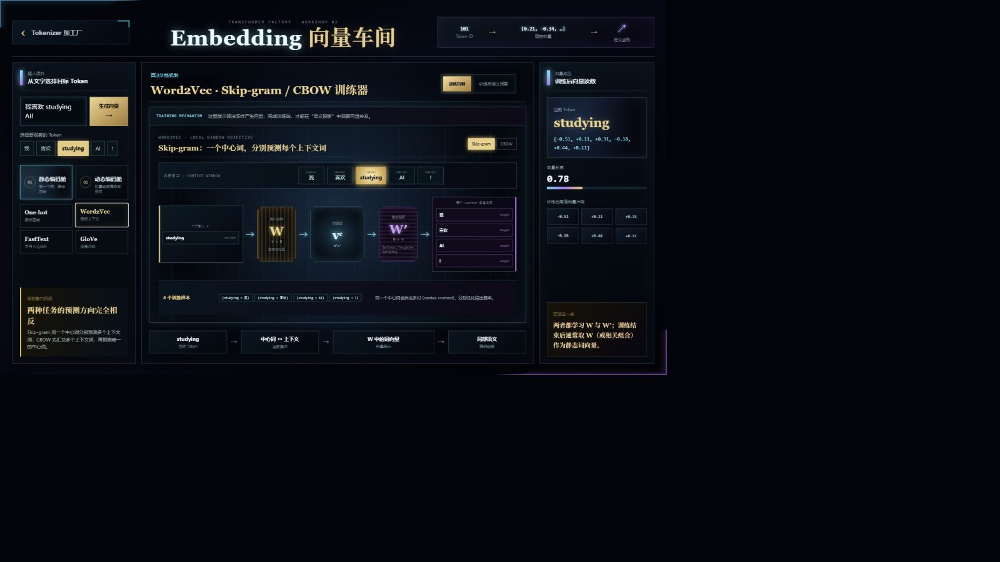
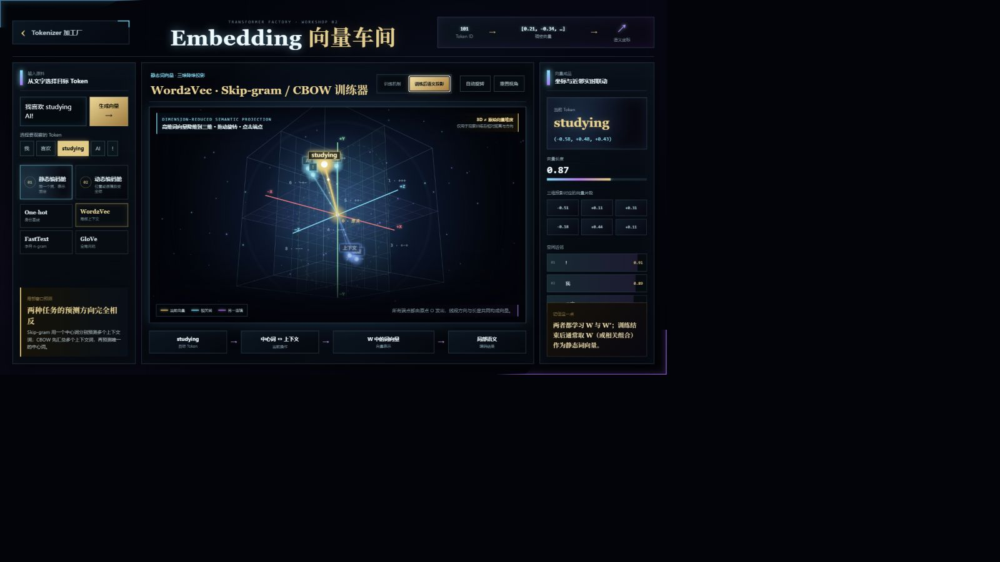

# LLM 原理加工厂：Tokenizer 与 Embedding

一个面向大模型初学者的暗黑机械加工厂风格互动教学网站。自然语言会沿动态传送带依次经历规则识别、Token 切分、词表 ID 映射与 Embedding 向量化；下方实验车间继续展示静态词向量与 ELMo、GPT、BERT 的上下文表示，让抽象流程变得可观察、可暂停、可交互。

## 在线体验

**[https://tokenizer-factory.pages.dev/](https://tokenizer-factory.pages.dev/)**

## 网站效果


从首页继续向下滚动，即可进入可训练的 Subword 实验机：


Tokenizer 最后一站可以进入独立的 Embedding 向量车间。下面是 Word2Vec 的训练机制工作台，页面中可以直接切换 Skip-gram 与 CBOW：



训练机制与三维空间分开呈现。切换到“训练后语义投影”，可以观察高维词向量降维后的方向、距离和语义近邻：



## 当前教学内容

### Tokenizer 五道加工工序

1. **输入文本**：自然语言作为完整原料进入生产线。
2. **规则识别**：扫描中文、英文、数字、空格与标点，只标记候选边界，不提前切开。
3. **切分 Token**：在激光切分工位生成独立 Token 块。
4. **映射 ID**：通过模型词表把 Token 映射成离散整数。
5. **Embedding**：用 Token ID 查询嵌入矩阵，得到连续向量。

### 三类 Tokenizer 粒度

- **Word-based**：以词为基本单元，序列较短，但词表容易膨胀，并存在未登录词问题。
- **Character-based**：以字符为基本单元，开放词表能力强，但序列通常更长。
- **Subword-based**：在词与字符之间寻找平衡，是现代大语言模型常见选择。

### 四种子词方案

- **BPE**：真实统计迷你语料中的相邻 Pair 频次，每轮合并当前最高频 Pair。
- **Byte-level BPE**：先把语料变成 UTF-8 字节符号，再运行同一套逐轮 Pair 合并实验。
- **WordPiece**：用 `pair_freq / (left_freq × right_freq)` 的课堂可观察评分近似训练过程，逐轮选择更具组合价值的 Pair。
- **Unigram Language Model**：从较大的候选集合出发，比较移除候选前后的语料负对数似然，逐轮剪除 `ΔNLL` 最小的候选。

### 可训练小型实验机

用户可以直接修改多行迷你训练语料，并设定计划训练轮数。BPE / Byte-level BPE / WordPiece 每轮新增一个合并 Token，Unigram 每轮剪除一个候选，因此四条路线可以使用同一种“轮数”控制方式。实验机提供：

- 初始化、训练一轮、自动训练、暂停与逐轮回退。
- 当前语料切分状态和每个词的出现次数。
- BPE / Byte-level BPE 的高频 Pair 排行。
- WordPiece 的 Pair 训练得分排行。
- Unigram 的候选剪枝顺序与 `ΔNLL` 依据。
- 当前词表、每轮机械动作、训练日志和“训练后的分词预览”。
- 基础符号数量超过用户目标时自动保护字符兜底，避免产生无法编码的词表。
- 教学大屏版界面：核心正文、Token、排行榜和对照表均使用更易读的大字号。
- 点击任意 Pair 或剪枝候选，可以在不执行训练的情况下检查其频次、得分或 `ΔNLL`。
- 训练执行时提供反应堆闪光、进度束扫过和完成状态反馈。

> **教学说明：** 页面中的 Token、ID 与向量用于解释原理，不代表某个线上模型的真实词表结果。真实切分会随模型、训练语料、词表大小、预处理规则和特殊 Token 配置而变化。

> **概念辨析：** SentencePiece 是可直接从原始句子训练的语言无关 tokenizer 工具框架，支持 BPE 与 Unigram 等模型；它不等同于一个独立于 BPE/Unigram 的单一切分算法。

### Embedding 向量车间

Tokenizer 流水线的 Token ID 可以继续送入独立的 Embedding 教学车间。当前车间把“编码或训练机制”与“训练后的三维语义投影”分开，避免把降维坐标误认为模型内部的原始向量。车间提供七条可切换路线：

- **One-hot**：为词表中的每个词分配一个独立维度，逐词显示标准稀疏向量，不使用三维语义空间。
- **Word2Vec**：在同一工作台精确对比 Skip-gram“中心词预测多个上下文词”和 CBOW“多个上下文词聚合预测中心词”，并展示输入矩阵 `W`、输出矩阵 `W′` 与训练样本。
- **FastText**：以 FastText-CBOW 为例，先为每个上下文词装配“整词向量 + 字符 n-gram 向量”，再把多个增强词向量送入输入层并叠加平均，最后沿分层 Softmax 的霍夫曼树路径预测唯一目标词；同时说明 CBOW/Skip-gram 与损失函数均属于可配置选择。
- **GloVe**：展示全局共现矩阵，以及对共现统计执行加权最小二乘学习的目标函数。
- **ELMo**：展示前向与后向 LSTM 如何结合多层状态，为同一个词生成上下文相关表示。
- **GPT**：通过因果注意力遮罩展示单向 Transformer 只能读取当前位置左侧信息。
- **BERT**：展示 Token、Segment 与 Position 三类输入向量相加后送入双向 Transformer Encoder。

除 One-hot 外，静态词向量和上下文向量都可以切换到“训练后语义投影”。该坐标系是高维向量经教学降维后的三维投影，只用于观察相对方向、距离和语义近邻，并不代表算法原始维度。空间支持鼠标拖动旋转、滚轮缩放、自动旋转、视角重置和端点选择。

## 交互特点

- 自定义输入中英文、数字与标点。
- 最多展示 12 个 Token，兼顾课堂可读性和流水线空间。
- 规则识别阶段只上色，不提前拆块。
- Token 块沿同一条动态传送带逐站加工。
- 一对一激光切分与多色 Token 封装。
- Token → ID 编码动画。
- ID → Embedding 向量化动画。
- 分步预览、自动演示和重置。
- Word / Character / Subword 三种粒度对比。
- BPE、Byte-level BPE、WordPiece、Unigram 可训练微型实验。
- 计划训练轮数可调、单步训练、自动训练、暂停和回退。
- One-hot、Word2Vec、FastText、GloVe、ELMo、GPT 与 BERT 七路线对比。
- Word2Vec 的 Skip-gram / CBOW 任务方向、`W` / `W′` 矩阵和投影神经元阵列同步演示；可直接点击工作台顶部 Token 切换中心词。
- Skip-gram 与 CBOW 均展示输入层、隐藏层、输出层神经元、Softmax/负采样以及反向传播更新。
- FastText-CBOW 输入层、子词增强隐藏层、分层 Softmax 霍夫曼树与反向传播路径，以及 GloVe 全局共现矩阵可视化。
- ELMo 双层双向 LSTM、GPT 因果 Decoder Block、BERT 双向 Encoder 与预训练头结构化演示。
- “训练机制”和“训练后语义投影”双视图切换，避免把三维降维图误解为原始模型结构。
- 可旋转、缩放、点选的三维嵌入空间。
- 静态向量与上下文动态向量的同词双句实验。
- 位置滑块、语境自动切换、最近邻和向量数值联动。

## 项目结构

```text
tokenizer-factory/
├─ index.html
├─ cinematic-belt.css
├─ cinematic-belt.js
├─ embedding.html
├─ embedding-workshop.css
├─ embedding-workshop.js
├─ README.md
└─ assets/
   ├─ tokenizer-factory-cinematic-v1.png
   ├─ readme-factory-preview.png
   ├─ readme-training-lab.png
   ├─ readme-embedding-workshop.png
   └─ readme-embedding-space.png
```

项目为纯静态 HTML、CSS 与 JavaScript，不依赖前端框架、数据库或构建工具。

## 本地运行

直接用浏览器打开 `index.html` 可以查看大部分内容。为避免浏览器对本地资源的限制，推荐在项目目录运行一个静态服务器：

```bash
python -m http.server 4174
```

然后访问：

```text
http://127.0.0.1:4174/
```

## 部署

当前线上版本部署在 Cloudflare Pages。由于项目没有构建步骤，可以直接上传包含 `index.html` 的完整目录：

```bash
npx wrangler pages deploy . --project-name tokenizer-factory
```

## 学术与技术参考

- Sennrich, Haddow & Birch, 2016：[*Neural Machine Translation of Rare Words with Subword Units*](https://aclanthology.org/P16-1162/)
- Schuster & Nakajima, 2012：[*Japanese and Korean Voice Search*](https://research.google/pubs/japanese-and-korean-voice-search/)
- Kudo, 2018：[*Subword Regularization: Improving Neural Network Translation Models with Multiple Subword Candidates*](https://aclanthology.org/P18-1007/)
- Kudo & Richardson, 2018：[*SentencePiece: A simple and language independent subword tokenizer and detokenizer for Neural Text Processing*](https://aclanthology.org/D18-2012/)
- OpenAI：[`tiktoken` educational BPE implementation](https://github.com/openai/tiktoken/blob/main/tiktoken/_educational.py)

## 路线图

- [x] Tokenizer 五工位动态流水线
- [x] Word / Character / Subword 粒度教学
- [x] 四种子词方案互动拆解
- [x] BPE 高频 Pair 逐轮合并训练机
- [x] Unigram 候选逐轮剪枝训练机
- [x] Embedding 七种表示方式互动实验
- [x] Word2Vec Skip-gram / CBOW 训练机制对照
- [x] FastText-CBOW 字符 n-gram、分层 Softmax 与 GloVe 共现矩阵可视化
- [x] 三维语义空间与上下文动态坐标
- [ ] 真实模型 tokenizer 对照实验
- [ ] Self-Attention 调度中心
- [ ] Transformer Block 生产线
- [ ] RAG 知识仓库与 Agent 控制中心

## 版权说明

本仓库当前未附加开源许可证，默认保留相关权利。在线演示可用于学习和评估；复制、分发、改编或商业使用前，请先获得项目所有者许可。
